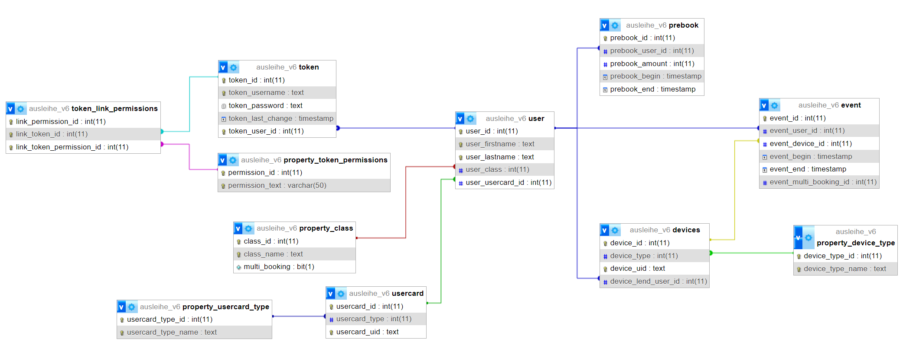

# REST API-Documentation

[V5 Documentation](/docs/v5/DOCS.md)

[V4 & V5 List of Endpoints](https://github.com/AlphaSoundZ/apollo/issues/4)

---

V3 Api documentation (incomplete and may have some errors):
https://documenter.getpostman.com/view/20621332/Uz59MyeK

## Setup

- Install PHP (8.0 works)
- Install MySql server (MariaDB for example)
- Install composer
- Navigate into ```/api/v5``` and run
```console
composer install
```
- configure .env

## Run
```console
php -S localhost:8080
```

Start MySql Server

Open in your browser to check if the API is running:
[http://localhost:8080/api/v5](http://localhost:8080/api/v5)

The response should look something like:
```json
{
  "status":"API_RUNNING",
  "message":"API ist aktiv",
  "code":200,
  "version":"v5",
  "timestamp":1688850752,
  "request":"/api/v5",
  "method":"GET"
}
```

## Project Structure

```console
├───api
│   ├───v5
│   │   ├───classes       (contains all classes that are used by the API)
│   │   ├───vendor        (created by composer)
│   │   ├───index.php     (main file with all routes)
│   │   ├───config.php    (handles database connection and contains some functions)
│   │   ├───.htaccess     (redirects all requests to index.php)
├───database
├───docs
├───.env                  (needs to be created, see .env.example for reference)
```

## Getting Started

### Prerequisites

- [PHP](https://www.php.net/) (8.0 works, but older versions should work too)
- [MySql Server](https://www.mysql.com/de/) (MariaDB for example)
- [Composer](https://getcomposer.org/) (dependency manager for PHP)
- [XAMPP](https://www.apachefriends.org/) (optional, you don't need to install PHP and MySql Server separately if you use XAMPP)

### Installation and Running

1. Clone the repository
   ```sh
   git clone https://github.com/AlphaSoundZ/apollo.git
   ```
2. Navigate into ```/api/v5``` and install composer packages
   ```sh
    cd api/v5            # navigate into the api directory
    composer install     # install composer packages
   ```
3. Configure [.env](#env-file) file (in the root directory)
   ```sh
    cd ../../            # navigate back to root directory
    cp .env.example .env # copy .env.example to .env
   ```
4. Start MySql Server
5. Start the API (in the root directory)
   ```sh
    php -S localhost:8080
   ```
6. Create a new database (replace database_name with your database name)
   ```sh
    mysql -u root -p
    CREATE DATABASE database_name;
    \q
   ```
7. Import the database file (replace database_name with your database name and database_file with the actual file name)
   ```sh
    mysql -u root -p database_name < database/database_file.sql
   ```
7. Open in your browser to check if the API is running:
    [http://localhost:8080/api/v5](http://localhost:8080/api/v5)

    The response should look something like:
    ```json
    {
      "status":"API_RUNNING",
      "message":"API ist aktiv",
      "code":200,
      "version":"v5",
      "timestamp":1688850752,
      "request":"/api/v5",
      "method":"GET"
    }
    ```

Check for errors (Windows Powershell):
```powershell
cd api/v5
Get-ChildItem -Filter *.php -Recurse | ForEach-Object {php -l $_.FullName}
```

## Authorization

During development you can disable the authorization in the .env file by setting ```AUTHORIZATION``` to ```0```.

If this is the first time you are using the API, you will first have to create a new user and token to authenticate yourself. 
To achieve this, disable the authorization in the .env file. Then send a POST request to ```/api/v5/user/create``` with the following body to create a user:
```json
{
  "firstname": "foo",
  "lastname": "bar",
  "class_id": 1,
}
```

If there is no class with the id 1, you will have to create a class first. You can do this by sending a POST request to ```/api/v5/user/class/create``` with the following body:
```json
{
  "name": "class_name",
  "multi_booking": 1,
}
```

If the user was created successfully, you can now create a token by sending a POST request to ```/api/v5/token/create``` with the following body so that you can authenticate yourself:
```json
{
  "username": "admin",
  "password": "admin",
  "user_id": :user_id, // replace :user_id with the id of the user you just created (you get the user id from the response of the user creation)
  "permissions": [1, 2, 3, 4, 5, 6, 7, 8, 9, 10, 11] // to get all permissions
}
```

If the token was created successfully, you can now authenticate yourself by sending a POST request to ```/api/v5/token/authorize``` with the following body:
```json
{
  "username": "admin",
  "password": "admin"
}
```

You will then receive a response with the token. Congratulations, you can now use the API with authorization!

## API Endpoints (v5)

link to the api documentation

## Status Codes

Defined in file [/api/v5/classes/response.class.php](/api/v5/classes/response.class.php)

| Status                     | Message                                              | Code  |
|----------------------------|------------------------------------------------------|-------|
| UNEXPECTED_ERROR           | Internal Server Error: {message}                     | 500   |
| PAGE_NOT_FOUND             | Page not found                                       | 404   |
| ROUTE_NOT_DEFINED          | Route does not exist                                 | 404   |
| SUCCESS                    | Success                                              | 200   |
| DEVICE_NOT_FOUND           | Device is not available in the database             | 404   |
| NOT_ALLOWED                | This request could not be executed due to missing permission | 403   |
| NOT_AUTHORIZED             | Token is not authorized                              | 401   |
| NOT_ALLOWED_FOR_THIS_CLASS | You are not allowed to borrow multiple devices at the same time | 403   |
| DEVICE_ALREADY_LENT        | The device is already being lent                     | 409   |
| REQUIRED_DATA_MISSING      | Input is missing                                     | 400   |
| DEVICE_NOT_LENT            | Device cannot be returned                            | 409   |
| RETURN_SUCCESS             | Device has been returned                             | 200   |
| INFO_SUCCESS               | Info is being provided                               | 200   |
| BOOKING_SUCCESS            | Booking successful                                   | 201   |
| DEVICE_TYPE_NOT_FOUND      | Device type not found                                | 404   |
| DEVICE_ALREADY_EXISTS      | Device already exists                                | 409   |
| USER_ALREADY_EXISTS        | User already exists                                 | 409   |
| USERCARD_ALREADY_ASSIGNED  | Usercard is already assigned to a user              | 409   |
| USERCARD_ALREADY_EXISTS    | Usercard already exists in the database             | 409   |
| BAD_REQUEST                | Bad Request                                          | 400   |
| CLASS_NOT_FOUND            | Class not found                                      | 404   |
| USER_NOT_FOUND             | User not found                                       | 404   |
| USER_ALREADY_ASSIGNED      | User is already assigned to a class                 | 409   |
| INVALID_PERMISSION          | Permission does not exist                            | 404   |
| USER_ALREADY_ASSIGNED_TO_TOKEN | User is already assigned to a token              | 409   |
| USERCARD_NOT_FOUND         | Usercard not found                                   | 404   |
| UID_ALREADY_EXISTS         | UID already exists in the database                  | 409   |
| INSERT_ERROR               | Error while inserting into the database             | 500   |
| TOKEN_NOT_FOUND            | Token not found                                      | 404   |
| USERCARD_TYPE_NOT_FOUND    | Usercard type not found                              | 404   |
| CLASS_ALREADY_EXISTS       | Class already exists in the database                 | 409   |
| DEVICE_TYPE_ALREADY_EXISTS | Device type already exists in the database           | 409   |
| USERCARD_TYPE_ALREADY_EXISTS | Usercard type already exists in the database       | 409   |
| DUPLICATE_ENTRY            | Duplicate entry found (SQL error: 1062)              | 500   |
| TOKEN_ALREADY_EXISTS       | Username of the token already exists                | 409   |
| INVALID_KEY                | Invalid Key                                          | 400   |
| ID_NOT_FOUND               | ID not found (this is just a placeholder)           | 404   |
| DUPLICATE                  | Duplicate entry in database (this is just a placeholder) | 409   |
| FOREIGN_KEY_ERROR          | Error while deleting, due to foreign key             | 409   |
| USER_HAS_BOOKINGS          | User still has active bookings                      | 409   |
| CLASS_HAS_USERS            | Class still has active users (when deleting class, users aren't allowed to borrow devices anymore) | 409   |
| DEVICE_HAS_ACTIVE_BOOKING  | Device is still being lent                          | 409   |
| DEVICE_TYPE_HAS_DEVICES    | Device type still has active devices                | 409   |
| USERCARD_HAS_USER          | Usercard is still assigned to a user                | 409   |
| USERCARD_TYPE_HAS_USERCARDS | Usercard type still has active usercards          | 409   |
| DELETE_OWN_TOKEN_NOT_ALLOWED | Deleting own token is not allowed                | 409   |
| TOKEN_HAS_USER             | Token is still assigned to a user                    | 409   |
| NO_CONTENT                 | No data found in the database                        | 204   |
| NO_CHANGES                 | No changes, old and new value are identical          | 200   |
| API_RUNNING                | API is active                                        | 200   |
| INTERNAL_SERVER_ERROR      | Internal server error                               | 500   |
| CONFLICT_WITH_PREBOOK      | Booking not allowed, as this device is reserved      | 409   |
| NOT_ENOUGH_DEVICES_AVAILABLE | Not enough devices available for prebooking        | 409   |
| USER_ALREADY_HAS_PREBOOKING_AT_THAT_TIME | User already has a prebooking at that time period | 409   |
| PREBOOK_TIME_NOT_ALLOWED   | Prebooking not allowed at that time                  | 409   |
| PREBOOK_DURATION_NOT_ALLOWED | Prebooking not allowed with that duration        | 409   |
| PREBOOK_NOT_FOUND          | Prebooking not found                                 | 404   |
| USER_ALREADY_HAS_TOKEN     | User already has a token                             | 409   |

## Permissions

|permission_id|permission_text|
|----|----|
|1|book|
|2|add_csv|
|3|CRUD_user|
|4|CRUD_usercard|
|5|CRUD_device|
|6|CRUD_user_class|
|7|CRUD_device_type|
|8|CRUD_usercard_type|
|9|CRUD_token|
|10|delete_event|
|11|CRUD_prebook|

## .env file

The .env file contains all the environment variables that are needed for the API to work. You can find an example file ```.env.example``` in the root directory of the project.

| Variable Name | Description                                                                                             |
| ------------- | ------------------------------------------------------------------------------------------------------- |
| HOST          | The host of the MySql Server                                                                            |
| DB            | The name of the database                                                                                |
| USERNAME      | The username of the MySql Server                                                                        |
| PASSWORD      | The password of the MySql Server                                                                        |
| JWT_SECRET    | The secret for the JWT token (you can generate a secret [here](https://www.grc.com/passwords.htm))      |
| AUTHORIZATION | If set to 1, authorization is enabled. If set to 0, authorization is disabled. It is enabled by default |
| PREBOOK_BUFFER| The time in minutes that a device can be prebooked before the actual booking time.                      |
| MIN_BOOKING_DURATION| The minimum prebooking time in minutes.                                                           |
| MAX_BOOKING_DURATION| The maximum prebooking time in minutes.                                                           |
| MIN_PREBOOK_TIME_DISTANCE| The minimum time in days between now and the prebooking.                                     |
| MAX_PREBOOK_TIME_DISTANCE| The maximum time in days between now and the prebooking.                                     |
## Database Structure



### Tables

| Table Name             | Description                                                                                 |
| ---------------------- | ------------------------------------------------------------------------------------------- |
| user                   | Contains all users                                                                          |
| usercard               | Contains all usercards                                                                      |
| devices                | Contains all devices; The ```device_lend_user_id``` is used with the event table in parallel to quickly identify the user who currently lends the device |
| token                  | Contains all tokens/accounts                                                                |
| property_device_type   | Contains all device types                                                                   |
| property_usercard_type | Contains all usercard types                                                                 |
| property_class         | Contains all classes; The ```multi_booking``` boolean is used to determine if a user can book multiple devices at the same time |
| property_token_pemissions | Contains all permissions a token can have                                                |
| token_link_permissions | Junction table between token and permissions                                                |
| prebook                | Contains all prebookings                                                                    |
| events                 | Contains all booking events; The ```multi_booking_id``` is used to identify a set of bookings that belong together (e.g. a user books 3 devices at the same time) |

## Code Structure

### Booking Class ([booking.class.php](/api/v5/classes/booking.class.php)) | Non-Static

| Method Name | Description                                                                                  | Access Control |
| ----------- | -------------------------------------------------------------------------------------------- | -------------- |
| execute     | Executes the booking and decides which action to take (lend, return, user info)              | public         |
| lend        | Lends the device to the user                                                                 | private        |
| return      | Returns the device                                                                           | private        |
| userInfo    | Returns information about the user                                                           | private        |
| deviceInfo  | Returns information about the device                                                         | private        |
| availableDevicesForBooking | Returns the amount of devices that are currently available for booking | public |
| maxBookingDuration | Return the maximum booking duration in minutes before the devices are needed for a prebooking | public |

With the booking class you can lend & return a device and get information about a user. The booking class is used by the booking route ```/api/v5/booking```. You can book devices using a usercard uid and the respective device uid. The user linked to the token does not have to be the same as the user on the usercard, but the token must have [book](#permissions)-rights.

### Prebook Class ([prebook.class.php](/api/v5/classes/prebook.class.php)) | Static

| Method Name | Description                                                                                  | Access Control |
| ----------- | -------------------------------------------------------------------------------------------- | -------------- |
| create      | Creates a prebooking                                                                         | public         |
| availableDevicesForPrebooking | Returns the amount of devices that are available for prebooking at the specified time period | public |

With the prebook class you can make a reservation for an amount of devices in a given period. The prebook class is used by the prebook route ```/api/v5/prebook/create```. You can prebook devices using a user id or using the token's user id (the token's user id is used if the parameter "user_id" is empty). The token must either have [prebook](#permissions)-rights[CRUD_prebook](#permissions)-rights.

### Search / Data Class ([search.class.php](/api/v5/classes/search.class.php)) | Static

| Method Name | Description                                                                                  | Access Control |
| ----------- | -------------------------------------------------------------------------------------------- | -------------- |
| select      | Used to select data with a specific response structure                                       | public         |
| search      | Used to search for data with a specific response structure                                   | public         |
| searchalgo  | Returns the haystack including the accordance percentage to the needle, used by search()     | public         |
| recursiveSearch | Searches recursively in an multidimensional array, used by searchalgo()                  | private        |
| fillResponseStructure | converts the database result to the response structure                             | private        |

With the search/data class you can do any sort of search and selection in the database. The search/data class is used by almost every ```get``` route. Other classes use the standard PDO methods to select data from the database because they don't need the specific response structure.

### Create Class ([create.class.php](/api/v5/classes/create.class.php)) | Static

| Method Name | Description                                                                                  | Access Control |
| ----------- | -------------------------------------------------------------------------------------------- | -------------- |
| user        | Creates a new user                                                                           | public         |
| usercard    | Creates a new usercard                                                                       | public         |
| device      | Creates a new device                                                                         | public         |
| property_class | Creates a new class                                                                       | public         |
| property_device_type | Creates a new device type                                                           | public         |
| property_usercard_type | Creates a new usercard type                                                       | public         |
| token       | Creates a new token/account                                                                  | public         |

With the create class you can create a new user, usercard, device, class, device type, usercard type or token. The create class is used by most of the ```post``` routes.

### Update / DataUpdate Class ([update.class.php](/api/v5/classes/update.class.php)) | Static

| Method Name | Description                                                                                  | Access Control |
| ----------- | -------------------------------------------------------------------------------------------- | -------------- |
| update      | Modifies a database entry                                                                    | public         |
| token       | Modifies a token/account                                                                     | public         |
| getIdentityColumn | Returns the identity column of a table                                                 | private        |

The update class is used by most of the ```patch``` routes and as the name suggests, it is used to update data in the database.

### Delete Class ([delete.class.php](/api/v5/classes/delete.class.php)) | Static

| Method Name | Description                                                                                  | Access Control |
| ----------- | -------------------------------------------------------------------------------------------- | -------------- |
| delete      | Deletes a database entry                                                                     | public         |
| deleteToken | Deletes a token/account                                                                      | public         |
| deletePrebook | Deletes a prebooking                                                                       | public         |
| reset       | Deletes all Rows of a table (and optionally resets id)                                       | public         |
| clearEvent  | Deletes all active events / bookings                                                         | public         |
| clearUserEvent | Deletes all active events / bookings of a user                                            | public         |
| getIdentityColumn | Returns the identity column of a table                                                 | private        |

The delete class is used by most of the ```delete``` routes and as the name suggests, it is used to delete data from the database. It also contains some methods to reset tables and user events.

### Token Class

| Method Name | Description                                                                                  | Access Control |
| ----------- | -------------------------------------------------------------------------------------------- | -------------- |
| getToken    | Generates a new token using login data and returns it                                        | public         |
| validateToken | Validates a token and returns the token data                                               | public         |

The token class is used by the token (authorization and validation) routes ```/api/v5/token``` and used to authorize each route in ```api/v5/config.php```. It is used to generate and validate tokens.

### CSV Class ([csv.class.php](/api/v5/classes/csv.class.php)) | Non-Static

| Method Name   | Description                                                                                | Access Control |
| ------------- | ------------------------------------------------------------------------------------------ | -------------- |
| add           | Adds a csv file to the database                                                            | public         |
| addRow        | Adds a row to the database                                                                 | private        |
| checkForError | Checks if there is an error in the csv file and throws an error if there is one            | private        |

With the CSV class you can import a csv file into the database. The CSV class is used by the csv route ```/api/v5/csv/import```.

### Exception Handler Class ([exception_handler.class.php](/api/v5/classes/exception_handler.class.php)) | Non-Static

Class that handles all exceptions. The exception handler class is used by the ```error()```-method in the [response.class.php](/api/v5/classes/response.class.php) file. If you want to throw an exception, you can do it by calling the ```Response::error()```-method.

### Response Class ([response.class.php](/api/v5/classes/response.class.php)) | Static

| Method Name | Description                                                                                  | Access Control |
| ----------- | -------------------------------------------------------------------------------------------- | -------------- |
| error       | Throws an exception and sends a response with details of the error to the client             | public         |
| success     | Sends a response to the client                                                               | public         |

The file also contains some constants for the status codes and messages. It uses a pseudo-enumeration to define the status codes and messages since PHP does not support enumerations before PHP 8.1.

### Request Processing

- The request is received by the [index.php](/api/v5/index.php) file
- The [index.php](/api/v5/index.php) file checks if the request is valid and if the route exists
- The respective route has the following structure: ```/api/v5/{route}```
  - ```authorize({permission})``` checks if the token has the required permission
  - ```getData({method}, {required_params}, {optional_params})``` gets the data from the request body and checks the required parameters
- The route then calls the respective class and method to process the request
- Errors are handled by the response class (```Response::error()``` is called if an error occurs)
- ```Response::success()``` sends the response back to the client

## Security

### Token

The token is generated using the [JWT](https://jwt.io/) standard. The token contains the following data:
```json
{
  "permissions": [ // permission id's of the token
    1,
    2,
    3,
    4,
    5,
    6,
    7,
    8,
    9,
    10,
    11
  ],
  "sub": 7, // user id of the token
  "iat": 1696795140 // timestamp of the token creation
}
```

The token is signed using the [HMAC](https://en.wikipedia.org/wiki/HMAC) algorithm with the [SHA-256](https://en.wikipedia.org/wiki/SHA-2) hash function. The secret is stored in the [.env](#env-file) file. The token has no expiration date yet. When the user changes his password or username, all tokens are no longer valid.

### Passwords

Passwords are hashed using the [bcrypt](https://en.wikipedia.org/wiki/Bcrypt) algorithm.

## Testing

The testing feature is currently in progress. You can find the tests in the [tests](/tests) directory.

## Authors

- **Jan Jacob Holst | AlphaSoudZ** - *Initial work* - [AlphaSoundZ](https://www.github.com/AlphaSoundZ)

## Dependencies

### Related Projects (using the API)

- [GHT-Buchungssystem](https://github.com/AlphaSoundZ/GHT-Buchungssystem): The booking system for the GHT, a web application for the raspberry pi to book devices, written in TypeScript and Vue.js.
- [Apollo-Manager](https://github.com/AlphaSoundZ/apollo-manager): The manager for the API, a web and desktop application to manage the Apollo-System, writen in Dart and Flutter.

### Composer

- [firebase/php-jwt](https://github.com/firebase/php-jwt)
- [vlucas/phpdotenv](https://github.com/vlucas/phpdotenv)
- [bramus/router](https://github.com/bramus/router)